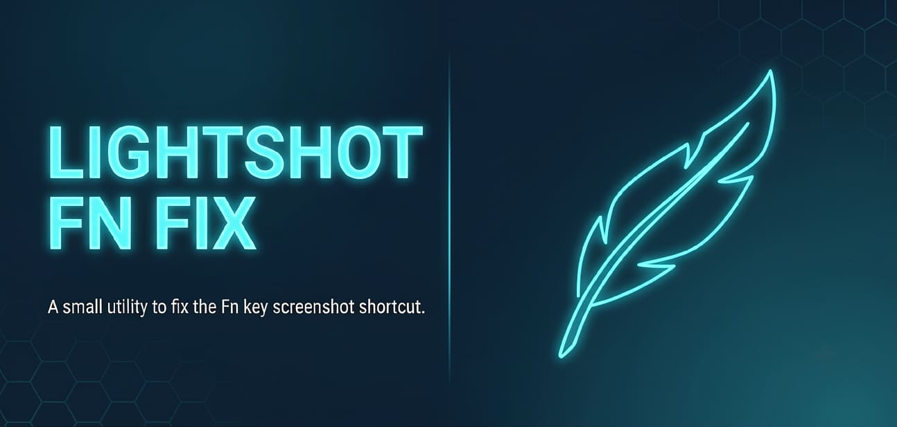
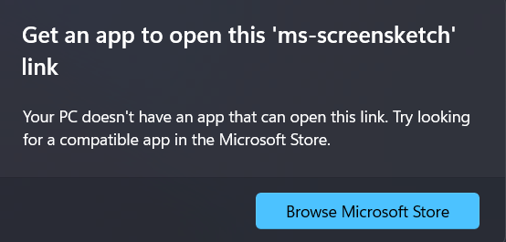

# 📸 Fix Lightshot FnLock (ms-screensketch)



A lightweight, automated Windows script that solves the `ms-screensketch` protocol error on PCs with **FnLock** enabled, especially when the native Windows Snipping Tool is uninstalled or disabled. It allows **Lightshot** to trigger instantly with a single press of the **PrtScn** (Print Screen) key, without holding `Fn`.

---

## ❓ The Problem

On laptops or keyboards with `FnLock` active where the native Windows *Snipping Tool* is either uninstalled or disabled, pressing the `PrtScn` key (without holding `Fn`) fails to send a standard `PrtScn` hardware signal.

Instead, Windows attempts to trigger the system protocol `ms-screensketch:`. Because Windows cannot find the native app, it displays a popup error message, preventing Lightshot from capturing the screen.



## ✨ The Solution

This fix registers a seamless, invisible handler in the Windows Registry for the `ms-screensketch` protocol:
1. Intercepts the `ms-screensketch` call triggered by pressing `PrtScn` with FnLock enabled.
2. Executes a background VBScript/PowerShell command to silently trigger a real physical `PrtScn` key event.
3. Lightshot instantly catches the key event and opens the screenshot selection area.

The process is 100% invisible with no terminal or prompt window flashing.

---

## 🚀 Installation & Usage

1. Download or clone this repository to your computer.
2. Make sure **Lightshot** is running in your system tray (feather icon).
3. Double-click the **`Fix_Lightshot.bat`** file to apply the fix.
4. Done! Press **`PrtScn`** anytime to capture your screen with Lightshot.

---

## 🧹 Uninstallation / Restore

To remove the fix and restore the default Windows registry settings, open Command Prompt (`cmd`) and run:

```cmd
reg delete "HKCU\Software\Classes\ms-screensketch" /f